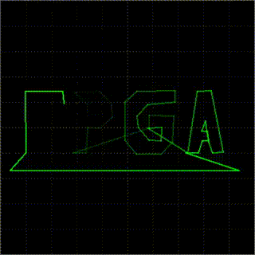

# Виртуальный осциллограф

[](./test/capture.mp4)

Программа рисует в окне виртуальную осциллограмму по координатам, получаемым из стандартного потока ввода/вывода или из файла (или из fifo). Координаты передаются в виде пар чисел из диапазона [-1:1], разделенных пробелом. Последние полученные N точек соединяются линиями. Количество точек задаётся в коде программы.

Для запуска программы необходимо установить интерпретатор языка [Racket](https://racket-lang.org/), скачав его с сайта или установив из репозитория своего дистрибутива.

Пример координат:

```
-0.312500 -0.203125
-0.414062 -0.195312
0.171875 -0.015625
0.171875 0.078125
0.367188 0.078125
0.359375 -0.109375
0.265625 -0.210938
```

## Тестовый пример

В папке `test` находится тестовый пример на SV, который выводит координаты через виртуальный ЦАП на виртуальный осциллограф. Запускается командой `make run`.
